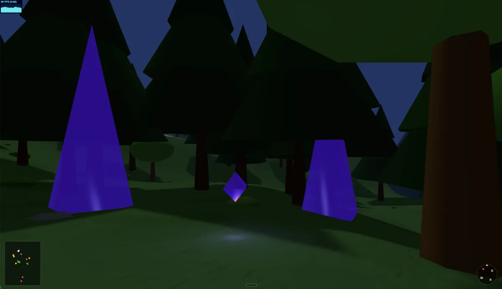

# Gemble

Explore a fog-lit forest and abandoned city in this mysterious first-person browser game. No download needed — just open and play.

**[▶ Play it now at gemble.eerichmond.com](https://gemble.eerichmond.com)**



---

## About

Gemble is a fun browser game built for the joy of exploration. Wander through a misty pine forest at dusk, find the road, and make your way into an eerie abandoned city. Keep your eyes open — there are creatures lurking, treasure chests to find, and a hidden gem somewhere out there.

No installation, no accounts. Just arrow keys and a sense of adventure.

**Status:** Active development — more surprises coming.

---

## World

```
         N
    ┌─────────────────────────────┐
    │  Dense pine forest          │  ← fog, rolling hills, crystals
    │  Gravel road winds south    │
    │  Asphalt begins             │  ← city entrance
    │  Abandoned city             │  ← buildings, flying eye, the gem
    └─────────────────────────────┘
         S
```

The terrain is a single 500×700 unit mesh. Hills flatten gradually as you head south into the city. Fog thickens in the valleys.

---

## Creatures & Things

| Entity | Description |
|---|---|
| **Flying Eye** | Hovers in the city, slowly turns to watch you |
| **Crystal Troll** | Stocky dark-blue figure with crystal spikes, sways in the forest |
| **Winged Monster** | Bat-winged silhouette, wings slowly beating |
| **Capybaras** | Wander in small groups, oval-bodied and unhurried |
| **Crows** | Startle and scatter when you walk too close |

---

## Systems

- **Compass** — HUD compass locked to camera heading
- **Minimap** — Small canvas overlay (bottom-left) with a directional arrow for the player and colored dots for every entity
- **Treasure chests** — 4 unique loot items; open with Space, pick up loot, close again
- **Inventory** — Picked-up item follows the camera; press Shift+Space to hold it up in first-person view

---

## Tech Stack

| | |
|---|---|
| **Renderer** | [Three.js](https://threejs.org) r176 |
| **Language** | TypeScript (strict) |
| **Bundler** | Vite 6 |
| **Package manager** | Yarn Berry v4 |
| **Testing** | Vitest |

---

## Running Locally

```bash
yarn install
yarn dev      # → http://localhost:5173
```

**Controls**

| Key | Action |
|---|---|
| `↑ / ↓` | Move forward / back |
| `← / →` | Turn left / right |
| `Shift` + `↑` | Sprint |
| `Space` | Interact with chests |
| `Shift` + `Space` | Show held item |
